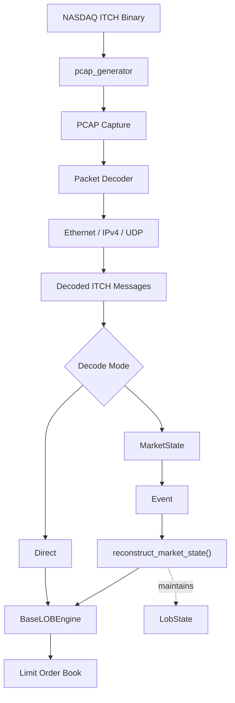

# PCAP Feed Decoder

A deterministic PCAP market data decoder for **NASDAQ TotalView-ITCH 5.0**
packet captures with integrated limit order book reconstruction.

The project provides utilities for generating PCAP test captures from the
public NASDAQ ITCH binary files and for reconstructing the corresponding
limit order book using **BaseLOBEngine**.

---

# Why a PCAP Generator?

NASDAQ publicly distributes historical **ITCH binary files**, not the original
network captures.

Those files contain a stream of ITCH messages without the surrounding
Ethernet, IPv4 and UDP packet headers that would normally be present on the
wire.

This repository therefore provides **pcap_generator**, which reconstructs
synthetic PCAP captures from the published ITCH binary files. These generated
captures allow the packet decoder to be developed, tested and benchmarked
without requiring access to proprietary network captures.

Historical ITCH binary files can be downloaded from:

https://emi.nasdaq.com/ITCH/Nasdaq%20ITCH/

---

# Architecture


---

# Decode Modes

The decoder supports two reconstruction modes that share the same underlying
limit order book implementation.

| Mode | Description |
|------|-------------|
| **Direct** | Decodes ITCH messages and applies them directly through BaseLOBEngine's `itch_*` interfaces. This is the default high-throughput reconstruction path. |
| **MarketState** | Converts decoded ITCH messages into the internal `Event` representation before replaying them through `reconstruct_market_state()`. This reconstructs the same limit order book while additionally maintaining `LobState` and derived market statistics. |

Both modes produce the same reconstructed limit order book. The `MarketState` 
mode exists to maintain derived market information for validation and market analytics 
without changing the underlying reconstruction logic.

---

# Clone

Clone the repository together with the BaseLOBEngine submodule.

```bash
git clone --recursive https://github.com/pankajj6/pcap_feed_decoder.git
```

If the repository has already been cloned:

```bash
git submodule update --init --recursive
```

---

# Repository Structure

```text
base_lob_engine/      BaseLOBEngine (Git submodule)
benchmarks/
data/
├── input/
└── generated/
include/
src/
```

---

# Usage

## Generate a PCAP

Generate a PCAP capture from a NASDAQ TotalView-ITCH 5.0 binary file.

```bash
./pcap_generator <input_binary> <output_pcap>
```

Example:

```bash
./pcap_generator \
    data/input/01302020.NASDAQ_ITCH50 \
    data/generated/01302020.pcap
```

The generator currently creates a compact PCAP suitable for testing and
development. The maximum number of packets written is configurable within the
generator source.

---

## Decode a PCAP

### Direct mode (default)

```bash
./pcap_decoder <pcap_file>
```

Example:

```bash
./pcap_decoder data/generated/01302020.pcap
```

---

### Verbose mode

```bash
./pcap_decoder <pcap_file> --verbose
```

---

### MarketState mode

Reconstruct the limit order book while maintaining `LobState`.

```bash
./pcap_decoder <pcap_file> --market-state
```

Example:

```bash
./pcap_decoder data/generated/01302020.pcap --market-state
```

---

### MarketState + Verbose

```bash
./pcap_decoder <pcap_file> --market-state --verbose
```

---

# Features

- NASDAQ TotalView-ITCH 5.0 packet decoding
- Ethernet / IPv4 / UDP packet parsing
- Deterministic limit order book reconstruction
- Direct reconstruction through `itch_*` interfaces
- Event-based reconstruction through `reconstruct_market_state()`
- Optional maintenance of derived market state (`LobState`)
- Synthetic PCAP generation from public NASDAQ ITCH binary files
