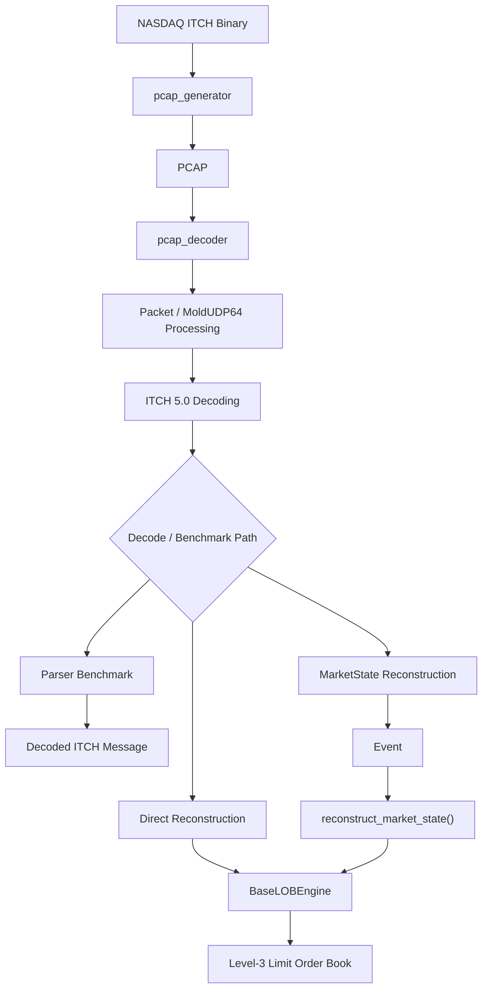

# PCAP Feed Decoder

A high-performance PCAP decoder for **NASDAQ TotalView-ITCH 5.0**, with support for low-latency ITCH message decoding and Level-3 limit order book reconstruction.

The decoder processes packet captures containing Ethernet, IPv4, UDP, MoldUDP64 and NASDAQ ITCH 5.0 data. It can be used either to benchmark the packet/message decoding path independently or to reconstruct Level-3 order books across the symbols present in the feed.

The repository also includes a PCAP generator for creating packet captures from the publicly available NASDAQ ITCH binary files. The generator is optional: if a suitable ITCH PCAP is already available, it can be passed directly to `pcap_decoder`.

---

## Table of Contents

- [Why this Project](#why-this-project)
- [Architecture](#architecture)
- [Performance](#performance)
- [PCAP Generator](#pcap-generator)
  - [Why a PCAP Generator?](#why-a-pcap-generator)
  - [Packet Size Model](#packet-size-model)
- [Decode Modes](#decode-modes)
- [Clone](#clone)
- [Usage](#usage)
- [Repository Structure](#repository-structure)
- [Features](#features)
- [Related Projects](#related-projects)

---

## Why this Project

NASDAQ TotalView-ITCH 5.0 market data is commonly available as historical ITCH binary files, while packet-oriented applications work with the network packets in which those messages are transmitted.

This project provides a packet-level processing path for NASDAQ ITCH 5.0 PCAP data. It is intended to be useful both for benchmarking packet/message processing and for working with real market-data captures when they are available.

The decoder currently provides:

* PCAP packet and MoldUDP64 processing
* NASDAQ TotalView-ITCH 5.0 message decoding
* field extraction and byte-order conversion
* MoldUDP64 session and sequence-number handling
* Level-3 limit order book reconstruction
* separate benchmarking of message decoding and full book reconstruction
* per-stock benchmarking through a compile-time stock-locate filter

The decoder can be used directly with an existing PCAP capture. The included `pcap_generator` is an optional utility for cases where a packet capture is not available.

NASDAQ's public historical ITCH data is distributed as length-prefixed ITCH binary streams rather than the original packet captures. The generator uses those real historical ITCH messages to construct PCAP files with the network framing required by the decoder. This makes it possible to benchmark and test packet-level processing using publicly available data without requiring access to a proprietary packet capture.

The current implementation focuses on deterministic decoding and Level-3 reconstruction. The packet-decoding layer is also intended to provide a foundation for separating raw feed processing from downstream market-data processing as the project develops. This can include producing clean decoded ITCH data for independent research and feature-extraction pipelines rather than requiring all downstream work to be coupled directly to packet-to-book reconstruction.

---

# Architecture



The decoder processes the PCAP in several layers:

1. **PCAP packet processing**
   Reads the packet records and extracts the captured network frame.

2. **Network and MoldUDP64 processing**
   Parses the Ethernet/IP/UDP/MoldUDP64 framing and tracks the MoldUDP64 session and packet sequence number.

3. **ITCH 5.0 decoding**
   Extracts the length-prefixed ITCH messages and decodes their fields, including the required byte-order conversions.

4. **Optional downstream processing**
   Decoded messages can either stop at the parser/decoding layer for benchmarking, or be passed into the Level-3 reconstruction path.

The decoder also contains sequence handling for packets that arrive out of order. Packets that are ahead of the expected sequence number are temporarily held in a bounded buffer and processed when the missing sequence becomes available. Packets that arrive too late, or cannot be retained within the configured buffering window, are counted as out-of-order drops.

The included `pcap_generator` is a separate input-generation utility. It is useful when the original packet capture is unavailable, but it is not required by the decoder.

---

# Performance

Benchmarks were run on a **15 million packet PCAP (~7 GB)** generated from the publicly available NASDAQ TotalView-ITCH binary data. The capture contains **190,907,472 ITCH messages** across **all active symbols**.

Latency is measured **once per packet**: from the beginning of packet processing until the complete packet has been processed. The reported P50/P95/P99 values therefore represent **full packet-processing latency**, not per-ITCH-message latency.

## All-Symbol Parser

`MEASURE_PARSER_LATENCY` benchmarks the packet and ITCH decoding path across the complete feed without Level-3 order book updates.

**~96.0 million ITCH messages/sec**

**P50: 40 ns · P95: 291 ns · P99: 451 ns**

| Metric | Result |
|---|---:|
| Packets/sec | ~7.54 million |
| ITCH messages/sec | **~96.0 million** |
| Total packets | 15,000,000 |
| Total ITCH messages | 190,907,472 |
| P50 | **40 ns** |
| P95 | **291 ns** |
| P99 | **451 ns** |

Repeated runs on the same capture produced approximately **94–96 million ITCH messages/sec**.

## Single-Stock Parser

`SPECIFIC_STOCK_LOCATE` allows the parser to isolate a single stock while continuing to traverse the complete PCAP.

For the benchmark capture, stock locate `398` corresponds to **AMZN**.

| Metric | Result |
|---|---:|
| Packets/sec | ~12.70 million |
| Selected ITCH messages/sec | **~215,785** |
| Total packets traversed | 15,000,000 |
| Selected ITCH messages | 254,926 |
| P50 | **20 ns** |
| P95 | **100 ns** |
| P99 | **250 ns** |

## Single-Stock Level-3 Reconstruction

`MEASURE_RECON_LATENCY` enables Level-3 reconstruction for the selected stock.

| Metric | Result |
|---|---:|
| Packets/sec | ~11.01 million |
| Selected ITCH messages/sec | **~187,146** |
| Total packets traversed | 15,000,000 |
| Selected ITCH messages | 254,926 |
| P50 | **20 ns** |
| P95 | **91 ns** |
| P99 | **652 ns** |

## Full-Feed Reconstruction — Stress Test

The full reconstruction benchmark processes the complete feed and maintains Level-3 order books across **5,000+ active symbols**.

This represents the substantially heavier workload of maintaining thousands of order-level books while processing the complete market-data stream.

**~5.59 million ITCH messages/sec**

**P50: 592 ns · P95: 9.06 µs · P99: 11.25 µs**

| Metric | Result |
|---|---:|
| Packets/sec | ~438,947 |
| ITCH messages/sec | **~5.59 million** |
| Total packets | 15,000,000 |
| Total ITCH messages | 190,907,472 |
| P50 | **592 ns** |
| P95 | **9.06 µs** |
| P99 | **11.25 µs** |

The higher packet-processing latency reflects the amount of work performed for each packet when Level-3 reconstruction is enabled across the full set of active symbols.

---

# PCAP Generator

## Why a PCAP Generator?

NASDAQ publicly distributes historical TotalView-ITCH data as length-prefixed ITCH binary files rather than the original network packet captures.

These files contain the actual historical ITCH messages, but not the Ethernet, IPv4, UDP and MoldUDP64 framing that surrounds those messages when the feed is transmitted over the network.

`pcap_generator` reconstructs this missing framing and writes the result as a PCAP file that can be consumed directly by `pcap_decoder`.

The generated PCAP contains:

* Ethernet headers
* IPv4 headers
* UDP headers
* MoldUDP64 headers
* the original length-prefixed NASDAQ ITCH messages

The ITCH messages are taken directly from the publicly available NASDAQ historical data. The packet boundaries and network headers are constructed by the generator.

The resulting file is therefore **synthetic at the packet-framing level, not at the market-data level**. It provides a reproducible way to test and benchmark packet-oriented software using real historical ITCH messages without requiring access to an original packet capture.

If an actual NASDAQ ITCH PCAP is already available, the generator is not required. The capture can be passed directly to `pcap_decoder`.

---

## Packet Size Model

The initial version of the generator packed ITCH messages into each packet until the 1500-byte IP MTU was reached. This produces valid PCAP data, but results in packets that are predominantly close to the maximum size.

The current generator instead varies the packet-size boundary using a **three-state Markov process**. The purpose is to introduce variation and temporal clustering in packet sizes rather than treating every packet independently or filling every packet to the MTU.

The three states are:

| State     |      Packet size | Target message density |
| --------- | ---------------: | ---------------------- |
| **Quiet** | 114 or 166 bytes | 1–2 messages           |
| **Mid**   |    218–582 bytes | 3–10 messages          |
| **Burst** |       1514 bytes | Up to the MTU          |

The packet boundaries are derived from the protocol structure. The generated frame reserves 62 bytes for the Ethernet, IPv4, UDP and MoldUDP64 headers. A maximum-size ITCH message occupies 50 bytes, and its 2-byte length prefix makes the maximum message record 52 bytes. This gives the 114-byte one-message boundary and the subsequent 52-byte increments used by the generator. 

### State distribution

The target long-run state distribution is:

* **60% Quiet**
* **20% Mid**
* **20% Burst**

The choice of a non-uniform packet-size distribution is motivated by published measurements of market-data packet captures. In particular, Keysight's analysis of market-data feeds shows that packet-size distributions vary by exchange and that averages alone do not capture the range of packet sizes present in real feeds. ([Keysight](https://www.keysight.com/blogs/en/tech/nwvs/2020/06/10/packet-sizes-for-market-data-feeds-and-their-impact-on-latency))

The transition probabilities used by the generator are:

| From / To | Quiet |  Mid | Burst |
| --------- | ----: | ---: | ----: |
| **Quiet** |  0.80 | 0.18 |  0.02 |
| **Mid**   |  0.56 | 0.28 |  0.16 |
| **Burst** |  0.04 | 0.18 |  0.78 |

These values are not independent random weights chosen for each packet. They are the transition probabilities of the Markov process required to produce the target long-run state distribution while retaining persistence between states.

The transition matrix was derived from the target state frequencies using the stationary-distribution relationship of the Markov chain, with state persistence chosen to produce clustered periods of similar packet sizes. The calculation and derivation are documented in the project's design notes and will be described more fully if the packet-generation methodology is published separately.

The implementation represents the probabilities using a 16-bit integer scale and uses a lightweight WyRand-based generator for the state transition and packet-size selection.

### Packet-size regimes

The three states correspond to different packet-size regimes:

**Quiet**

The generator selects either 114 or 166 bytes, corresponding to packets containing approximately one or two maximum-size ITCH message records.

**Mid**

The generator selects packet boundaries from 218 through 582 bytes in 52-byte increments, corresponding to approximately three through ten maximum-size message records.

**Burst**

The packet boundary is fixed at 1514 bytes, corresponding to a 1500-byte IP MTU plus the 14-byte Ethernet header.

The generator then packs actual ITCH records from the source binary until the selected packet boundary is reached or the next message would exceed it.

### Current scope

The current generator models **packet-size variation and clustering**. It does not attempt to reproduce the exact packet boundaries of a historical exchange capture.

It also does not currently generate packet loss or out-of-order packet sequences. The decoder already has bounded sequence-number buffering for handling packets that arrive out of order. A future generator extension can deliberately introduce gaps or reorder packets to provide controlled test cases for that decoder functionality.

---

# Decode Modes

The decoder provides two Level-3 reconstruction paths built on the same underlying `BaseLOBEngine`.

| Mode            | Description                                                                                                                                                                                              |
| --------------- | -------------------------------------------------------------------------------------------------------------------------------------------------------------------------------------------------------- |
| **Direct**      | Decodes each ITCH message and applies it directly through the engine's `itch_*` interfaces.                                                                                                              |
| **MarketState** | Converts decoded ITCH messages into the internal `Event` representation and replays them through `reconstruct_market_state()`. This path also supports maintaining `LobState` derived market statistics. |

Both reconstruction modes operate on the same decoded ITCH feed and reconstruct the Level-3 order book.

### Parser-only benchmark

The decoder also has a separate parser benchmark path enabled with `MEASURE_PARSER_LATENCY`.

When this macro is defined, the ITCH messages are still read and decoded, including the field extraction and byte-order conversion, but the Level-3 book update is skipped.

This allows the packet/message decoding path to be measured independently from the substantially more expensive order-book reconstruction.

The corresponding `MEASURE_RECON_LATENCY` macro instead measures the decoding & reconstruction path with the Level-3 book updates enabled.

### Single-stock benchmarking

`SPECIFIC_STOCK_LOCATE` provides a compile-time way to isolate processing for one stock locate when benchmarking.

For example:

```bash
-DSPECIFIC_STOCK_LOCATE=398
```

causes messages whose stock locate is not `398` to be skipped after the stock locate has been decoded. The PCAP is still traversed normally, so the benchmark continues to read and inspect the complete packet stream.

This is intended for **per-ticker benchmarking**, not as a replacement for the full-feed decoder.

Stock locate numbers are feed-specific identifiers and are not self-explanatory. For the benchmark capture used here, stock locate `398` corresponds to **AMZN**. A user working with another capture should determine the relevant stock-locate mapping for that feed rather than assuming the number identifies the same ticker universally.

---

# Clone

Clone the repository together with the `base_lob_engine` submodule.

```bash
git clone --recursive https://github.com/pankajj6/pcap_feed_decoder.git
cd pcap_feed_decoder
````

If the repository has already been cloned without its submodules:

```bash
git submodule update --init --recursive
```

---

# Repository Structure

```text
pcap_feed_decoder/
├── base_lob_engine/       Git submodule
├── data/
│   ├── input/             NASDAQ ITCH binary input
│   └── generated/         Generated PCAP files
├── include/
│   ├── itch_packet_processor.h
│   └── nasdaq_itch50.h
├── src/
│   ├── pcap_decoder.cpp
│   └── pcap_generator.cpp
├── .gitignore
├── .gitmodules
└── README.md
```

The `base_lob_engine` directory is maintained as a separate Git repository and is included here as a submodule.

---

# Usage

The project does not require a build system. The decoder and generator can be compiled directly with a C++23 compiler.

## Build the Decoder

```bash
g++ -std=c++23 -O3 \
    -Ibase_lob_engine \
    -Iinclude \
    src/pcap_decoder.cpp \
    -o pcap_decoder
```

The resulting executable accepts a PCAP file:

```bash
./pcap_decoder <pcap_file>
```

For example:

```bash
./pcap_decoder data/generated/01302020.pcap
```

### Verbose Output

Use `--verbose` to print decoded sample messages while processing the capture:

```bash
./pcap_decoder data/generated/01302020.pcap --verbose
```

### MarketState Reconstruction

The default reconstruction path applies decoded ITCH messages directly through the engine's `itch_*` interfaces.

To use the `MarketState` path instead:

```bash
./pcap_decoder data/generated/01302020.pcap --market-state
```

The two options can also be combined:

```bash
./pcap_decoder data/generated/01302020.pcap \
    --market-state \
    --verbose
```

---

## Parser Benchmark

Compile with `MEASURE_PARSER_LATENCY` to benchmark packet and ITCH message decoding without Level-3 order book updates:

```bash
g++ -std=c++23 -O3 \
    -DMEASURE_PARSER_LATENCY \
    -Ibase_lob_engine \
    -Iinclude \
    src/pcap_decoder.cpp \
    -o parser_bench
```

Run it with:

```bash
./parser_bench data/generated/01302020.pcap
```

This processes the complete packet stream and decodes the ITCH messages across all symbols while excluding the order-book update path.

---

## Full Reconstruction Benchmark

Compile with `MEASURE_RECON_LATENCY` to benchmark the complete packet-to-Level-3 reconstruction path:

```bash
g++ -std=c++23 -O3 \
    -DMEASURE_RECON_LATENCY \
    -Ibase_lob_engine \
    -Iinclude \
    src/pcap_decoder.cpp \
    -o recon_bench
```

Run:

```bash
./recon_bench data/generated/01302020.pcap
```

This includes ITCH decoding and the corresponding Level-3 order book updates.

---

## Single-Stock Benchmark

`SPECIFIC_STOCK_LOCATE` can be combined with either benchmark mode to isolate one stock.

For example, the benchmark in this repository uses stock locate `398`, which was identified as AMZN in the benchmark capture:

```bash
g++ -std=c++23 -O3 \
    -DMEASURE_PARSER_LATENCY \
    -DSPECIFIC_STOCK_LOCATE=398 \
    -Ibase_lob_engine \
    -Iinclude \
    src/pcap_decoder.cpp \
    -o parser_bench
```

Run:

```bash
./parser_bench data/generated/01302020.pcap
```

For single-stock Level-3 reconstruction:

```bash
g++ -std=c++23 -O2 \
    -DMEASURE_RECON_LATENCY \
    -DSPECIFIC_STOCK_LOCATE=398 \
    -Ibase_lob_engine \
    -Iinclude \
    src/pcap_decoder.cpp \
    -o recon_bench
```

Run:

```bash
./recon_bench data/generated/01302020.pcap
```

The stock-locate value is feed-specific. `398` is not a universal identifier for AMZN; it is the value observed for AMZN in the benchmark capture used here.

---

## Generate a PCAP

`pcap_generator` is an optional utility for converting the publicly available length-prefixed NASDAQ ITCH binary data into a PCAP with reconstructed network framing.

Build it with:

```bash
g++ -std=c++23 -O3 \
    -Iinclude \
    src/pcap_generator.cpp \
    -o pcap_generator
```

Usage:

```bash
./pcap_generator <input_binary> <output_pcap> [max_packets]
```

Example:

```bash
./pcap_generator \
    data/input/01302020.NASDAQ_ITCH50 \
    data/generated/01302020.pcap
```

To limit the generated capture to a specific number of packets:

```bash
./pcap_generator \
    data/input/01302020.NASDAQ_ITCH50 \
    data/generated/01302020.pcap \
    1000000
```

If a suitable NASDAQ ITCH PCAP is already available, `pcap_generator` is not required. The PCAP can be passed directly to `pcap_decoder`.

---

# Features

* NASDAQ TotalView-ITCH 5.0 message decoding
* Ethernet, IPv4, UDP and MoldUDP64 packet processing
* MoldUDP64 session and sequence-number handling
* Bounded out-of-order packet buffering
* Level-3 limit order book reconstruction
* Direct reconstruction through `itch_*` interfaces
* Event-based reconstruction through `reconstruct_market_state()`
* `LobState` support for derived market-state statistics
* Separate parser and reconstruction benchmarks
* Compile-time single-stock benchmarking with `SPECIFIC_STOCK_LOCATE`
* PCAP generation from public NASDAQ ITCH binary data
* Optional verbose decoded-message output

---

# Related Projects

- [**Base LOB Engine**](https://github.com/pankajj6/base_lob_engine): The underlying C++ limit order book and matching engine used by this decoder for Level-3 reconstruction.
- [**TALON**](https://github.com/pankajj6/talon): A deterministic, latency-aware agent-based market simulator that utilizes the same `base_lob_engine` for discrete-event exchange matching.