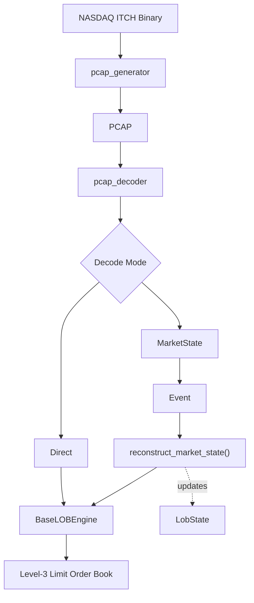

# PCAP Feed Decoder

A deterministic PCAP decoder for **NASDAQ TotalView-ITCH 5.0** focused on
Level-3 limit order book reconstruction.

The repository also provides a PCAP generator for constructing reproducible
benchmark datasets from the publicly available NASDAQ ITCH binary files.

---

## Table of Contents
- [Why this Project](#why-this-project)
- [Why a PCAP Generator?](#why-a-pcap-generator)
- [Architecture](#architecture)
- [Decode Modes](#decode-modes)
- [Performance](#performance)
- [Clone](#clone)
- [Repository Structure](#repository-structure)
- [Usage](#usage)
- [Features](#features)
- [Related Projects](#related-projects)

---

# Why this Project

Most publicly available NASDAQ historical datasets are distributed as decoded
ITCH binary streams rather than packet captures.

This repository provides a complete packet-to-book reconstruction pipeline by:

- generating synthetic PCAP captures from public NASDAQ ITCH binaries,
- extracting MoldUDP64 packet payloads,
- decoding NASDAQ TotalView-ITCH 5.0 messages,
- reconstructing Level-3 limit order book per symbol using
  [BaseLOBEngine](https://github.com/pankajj6/base_lob_engine).

The current implementation is focused on deterministic reconstruction and
benchmarking.

Future work will introduce an internal protocol representation that separates
packet decoding from downstream market research and feature extraction.

---

# Why a PCAP Generator?

NASDAQ publicly distributes historical **ITCH binary files**, not the original
network packet captures.

Those binary files contain a continuous stream of length-prefixed ITCH messages
without the surrounding packet framing used during transmission.

`pcap_generator` reconstructs synthetic PCAP files from those binaries, making
it possible to develop, validate and benchmark packet-based decoders without
requiring proprietary captures.

Historical ITCH binaries are available from:

https://emi.nasdaq.com/ITCH/Nasdaq%20ITCH/

During generation, ITCH messages are packed into each packet until the
configured MTU limit is reached before a new packet is started. This keeps the
number of packets small for benchmarking while maximizing the amount of market
data carried by each generated packet.

---

# Architecture



---

# Decode Modes

The decoder provides two reconstruction paths built on the same underlying
order book implementation.

| Mode | Description |
|------|-------------|
| **Direct** | Decodes each ITCH message and applies it directly through BaseLOBEngine's `itch_*` interfaces. This is the default reconstruction path and minimizes reconstruction overhead. |
| **MarketState** | Converts decoded ITCH messages into the internal `Event` representation before replaying them through `reconstruct_market_state()`. In addition to reconstructing the same order book, this mode maintains `LobState` containing derived market statistics. |

Both modes reconstruct the same Level-3 order book.

The additional `MarketState` path exists for validation and market analytics,
allowing derived market features to be maintained without changing the
underlying reconstruction logic.

---

# Performance

Performance is reported for the complete reconstruction pipeline, from reading
packets in the PCAP file to updating the reconstructed limit order book.

The benchmark dataset below is generated using the included
`pcap_generator`.

```bash
./pcap_generator \
    data/input/01302020.NASDAQ_ITCH50 \
    data/generated/01302020.pcap \
    1000000
```

This produces a capture of approximately **1.5 GB** containing:

| Property | Value |
|----------|------:|
| Packets | 1,000,000 |
| ITCH Messages | 45,574,109 |
| Symbols | ~5,000+ |

### Message Distribution

| Type | Count |
|------|------:|
| Adds | 19,823,585 |
| Deletes | 17,638,479 |
| Replaces | 4,281,676 |
| Cancels | 1,638,841 |
| Executions | 651,310 |

Because the generator packs ITCH messages until the configured MTU is reached,
a relatively small number of packets can carry a much larger number of ITCH
messages.

This packing strategy is used by the benchmark generator to maximize packet
utilization. It should not be interpreted as modelling how historical packet
captures were originally transmitted.

### Throughput

Release build (`-O3`)

| Metric | Value |
|--------|------:|
| ITCH Messages / sec | ~5.8–6.0 Million |
| Packets / sec | ~120 Thousand |

The reported throughput includes:

- PCAP packet processing
- MoldUDP64 payload extraction
- ITCH message decoding
- Level-3 order book reconstruction

### Latency

Optional latency instrumentation can be enabled by compiling with the
`MEASURE_LATENCY` flag:

```bash
g++ -std=c++23 -O3 -DMEASURE_LATENCY \
    -Ibase_lob_engine \
    -Iinclude \
    src/pcap_decoder.cpp \
    -o exec
```

Measured on the benchmark dataset above:

| Metric | Latency |
|--------|--------:|
| P50 | 187 ns |
| P95 | 281 ns |
| P99 | 394 ns |
| Max | 36,536 ns |

Latency instrumentation is intended for benchmarking and is disabled in
normal builds because timestamp collection introduces measurable overhead.

---

# Clone

Clone the repository together with the BaseLOBEngine submodule.

```bash
git clone --recursive https://github.com/pankajj6/pcap_feed_decoder.git
```

If the repository has already been cloned:

```bash
git submodule update --init --recursive
```

---

# Repository Structure

```text
base_lob_engine/      Git submodule
benchmarks/
data/
├── input/
└── generated/
include/
src/
```

---

# Usage

## Generate a PCAP

```bash
./pcap_generator <input_binary> <output_pcap> [max_packets]
```

Example:

```bash
./pcap_generator \
    data/input/01302020.NASDAQ_ITCH50 \
    data/generated/01302020.pcap
```

The optional third argument limits the maximum number of packets generated.

```bash
./pcap_generator \
    data/input/01302020.NASDAQ_ITCH50 \
    data/generated/01302020.pcap \
    100000
```

The output allocation is computed automatically from the requested packet
count together with the PCAP global header, per-packet headers and the
configured MTU.

If a PCAP file is already available, this step can be skipped.

---

## Decode a PCAP

Default reconstruction:

```bash
./pcap_decoder <pcap_file>
```

Verbose logging:

```bash
./pcap_decoder <pcap_file> --verbose
```

MarketState reconstruction:

```bash
./pcap_decoder <pcap_file> --market-state
```

MarketState with verbose logging:

```bash
./pcap_decoder <pcap_file> --market-state --verbose
```

---

# Features

- NASDAQ TotalView-ITCH 5.0 decoding
- MoldUDP64 packet extraction
- Deterministic Level-3 limit order book reconstruction
- Direct reconstruction through `itch_*` interfaces
- Event-based reconstruction through `reconstruct_market_state()`
- Optional maintenance of derived market statistics through `LobState`
- PCAP generation from public NASDAQ ITCH binary files

---

# Related Projects

- [**Base LOB Engine**](https://github.com/pankajj6/base_lob_engine): The underlying C++ limit order book and matching engine used by this decoder for Level-3 reconstruction.
- [**TALON**](https://github.com/pankajj6/talon): A deterministic, latency-aware agent-based market simulator that utilizes the same `base_lob_engine` for discrete-event exchange matching.
