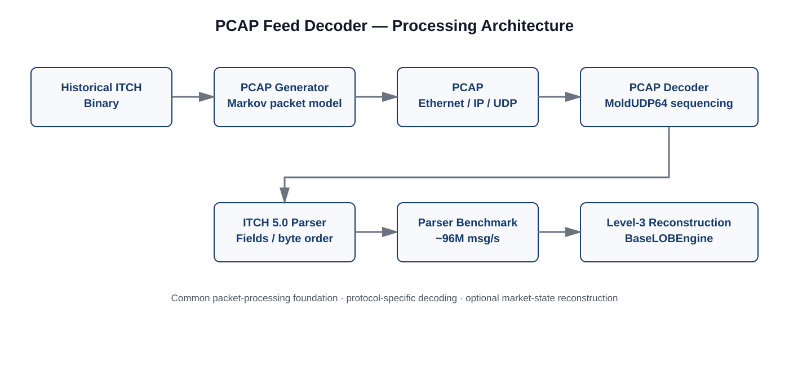

<div align="center">


# PCAP Feed Decoder

### Packet-level market-data processing and Level-3 reconstruction

**NASDAQ TotalView-ITCH 5.0 · C++23 · PCAP · MoldUDP64 · Level-3 LOB**

</div>

---

## Research context

**PCAP Feed Decoder** is a packet-level market-data processing system developed by **SMMG Research** for deterministic decoding, benchmarking, and Level-3 limit-order-book reconstruction.

The project bridges a practical gap in publicly available NASDAQ market-data research: historical TotalView-ITCH data is distributed as length-prefixed binary messages, while a network-facing decoder operates on packetized Ethernet/IP/UDP/MoldUDP64 traffic. The generator reconstructs this missing packet-framing layer around the original historical ITCH messages, providing a reproducible environment for packet-processing experiments.

The decoder is deliberately separated into a packet-processing layer and a protocol-specific decoding/reconstruction path, allowing the packet traversal and sequencing machinery to serve as a foundation for additional market-data protocols as the system evolves.

> **Data provenance:** the benchmark input contains historical NASDAQ ITCH messages from the publicly available binary feed data. The generated PCAP is synthetic at the packet-framing level; the underlying ITCH market-data records are not synthetically generated.

---

## System at a glance




The production path is organized around four conceptual layers:

1. **Packet processing** — reads PCAP records and extracts captured frames.
2. **Transport/session processing** — handles Ethernet/IP/UDP/MoldUDP64 framing and sequence state.
3. **Protocol decoding** — parses length-prefixed ITCH 5.0 messages and performs field conversion.
4. **Market-state processing** — optionally applies decoded events to a Level-3 order book.

This separation also makes the parser benchmark useful on its own: packet and message decoding can be measured without conflating it with order-book state mutation.

---

# Benchmark snapshot

Benchmarks were run against a **15 million packet PCAP (~7 GB)** containing **190,907,472 ITCH messages** across all active symbols.

Latency is instrumented **once per packet**, from the beginning of packet processing until the complete packet has been processed. It therefore describes packet-processing latency rather than the latency of an individual ITCH message.

### Packet / ITCH decoding

| Metric | Result |
|---|---:|
| Feed | NASDAQ TotalView-ITCH 5.0 |
| Packets | **15,000,000** |
| Capture size | **~7 GB** |
| ITCH messages | **190,907,472** |
| Throughput | **~96.0M ITCH messages/s** |
| Packet throughput | **~7.54M packets/s** |
| P50 | **40 ns** |
| P95 | **291 ns** |
| P99 | **451 ns** |

This is the parser-only path: ITCH messages are decoded across the complete feed while Level-3 book updates are excluded.

### Single-instrument Level-3 reconstruction

For a single selected instrument, the same packet stream can be traversed while only the target stock's decoded messages are passed into the reconstruction path.

For the benchmark capture, stock locate `398` corresponds to **AMZN**.

| Metric | Result |
|---|---:|
| Packets traversed | **15,000,000** |
| Selected ITCH messages | **254,926** |
| Selected-message throughput | **~187k messages/s** |
| Packet throughput | **~11.01M packets/s** |
| P50 | **20 ns** |
| P95 | **91 ns** |
| P99 | **652 ns** |

This benchmark is the representative reconstruction measurement for a single active instrument rather than the aggregate cost of simultaneously maintaining thousands of books.

### Full-feed stress test

A separate stress benchmark reconstructs Level-3 books across the complete set of active symbols in the capture.

| Metric | Result |
|---|---:|
| Packets | **15,000,000** |
| ITCH messages | **190,907,472** |
| Throughput | **~5.59M ITCH messages/s** |
| P50 | **592 ns** |
| P95 | **9.06 µs** |
| P99 | **11.25 µs** |

This is intentionally presented as a **stress workload**, not as the representative latency of a single-instrument reconstruction path. Its purpose is to characterize the cost of maintaining many order-level books while consuming the complete feed.

---

# Packet generation methodology

## Why generate PCAP?

Public historical NASDAQ TotalView-ITCH data is distributed as raw, length-prefixed binary streams rather than original packet captures. In a live feed, those messages are carried inside a network stack including Ethernet, IPv4, UDP, and MoldUDP64 framing.

The generator reconstructs those framing layers around the original ITCH records so that the resulting file can be consumed by the packet decoder.

The fixed network overhead is:

| Layer | Bytes |
|---|---:|
| Ethernet | 14 |
| IPv4 | 20 |
| UDP | 8 |
| MoldUDP64 | 20 |
| **Total** | **62** |

Each MoldUDP64 message record also carries a 2-byte length prefix. Using the maximum 50-byte ITCH message payload gives a 52-byte maximum message record, which defines the packet-size boundaries used by the generator.

---

## Stateful packet-size model

A simple MTU-filling strategy would produce valid packets, but would heavily bias the generated capture toward maximum-sized frames. Independent random packet sizes would have the opposite problem: they would remove temporal persistence between quiet and high-volume periods.

The current generator therefore uses a **three-state Markov process** to model packet-size regimes:

| State | Packet boundary | Approx. records |
|---|---:|---:|
| **Quiet** | 114 / 166 bytes | 1–2 |
| **Mid** | 218–582 bytes | 3–10 |
| **Burst** | 1514 bytes | up to MTU |

The target long-run state distribution is **60% Quiet / 20% Mid / 20% Burst**.

The transition matrix is:

| From → To | Quiet | Mid | Burst |
|---|---:|---:|---:|
| **Quiet** | 0.80 | 0.18 | 0.02 |
| **Mid** | 0.56 | 0.28 | 0.16 |
| **Burst** | 0.04 | 0.18 | 0.78 |

The matrix is constructed to combine the desired long-run state frequencies with persistence between states. Thus, packet sizes are not selected independently: a quiet interval tends to remain quiet, while a burst can persist across consecutive frames.

The generator implements the transition probabilities on a 16-bit integer scale and uses a lightweight WyRand-based pseudo-random generator. Packet-size selection reuses the generated random word rather than introducing additional distributions into the hot generation loop.

The design work evaluated several alternatives before settling on the inline Markov formulation, including continuous random sizing, a shuffled lookup table, a precomputed Markov sequence, and asynchronous double buffering. The final design avoids the artificial periodic boundary of a finite lookup sequence while retaining a single-threaded, predictable generation loop.

> The generator is a **packetization model**, not a claim that the resulting PCAP reproduces the exact packet boundaries of a historical exchange capture. The project uses real historical ITCH messages while modelling the missing network-framing layer.

The packet-generation design note records the evaluated alternatives, sizing derivation, transition-matrix construction, and optimized single-threaded implementation.

---

# Decoder architecture

## Packet processing

The decoder reads PCAP records and processes the captured Ethernet frame. The packet layer is responsible for traversing the capture rather than embedding exchange-specific market-state logic.

## MoldUDP64 sequencing

The decoder tracks MoldUDP64 session and sequence information. Packets arriving ahead of the expected sequence are retained in a bounded buffer and processed when the missing sequence becomes available. Packets that arrive too late, or cannot be retained within the configured window, are counted as out-of-order drops.

This sequence layer is independent of the downstream Level-3 reconstruction path.

## ITCH 5.0 decoding

The protocol layer extracts the length-prefixed ITCH records, decodes message fields, and performs the required byte-order conversions.

For the current implementation, NASDAQ TotalView-ITCH 5.0 is the supported market-data protocol. The surrounding packet-processing structure is kept sufficiently separated to support future protocol-specific decoders.

---

# Reconstruction paths

The decoder exposes two Level-3 paths over the same underlying `BaseLOBEngine`.

| Path | Operation |
|---|---|
| **Direct** | Decoded ITCH messages are applied directly through the engine's `itch_*` interfaces. |
| **MarketState** | Decoded messages are converted into the internal `Event` representation and replayed through `reconstruct_market_state()`. |

The MarketState path can additionally maintain `LobState` fields for derived market-state statistics.

The parser benchmark provides a third useful boundary: decoding can be measured without invoking either reconstruction path. This makes it possible to separate the cost of packet/message processing from the cost of maintaining exchange state.

---

# Reproducibility

The project is intentionally build-system-light. The decoder and generator can be compiled directly with a C++23 compiler.

```bash
git clone --recursive https://github.com/pankajj6/pcap_feed_decoder.git
cd pcap_feed_decoder
```

### Parser benchmark

```bash
g++ -std=c++23 -O3 \
    -DMEASURE_PARSER_LATENCY \
    -Ibase_lob_engine \
    -Iinclude \
    src/pcap_decoder.cpp \
    -o parser_bench

./parser_bench data/generated/01302020.pcap
```

### Single-stock reconstruction

```bash
g++ -std=c++23 -O2 \
    -DMEASURE_RECON_LATENCY \
    -DSPECIFIC_STOCK_LOCATE=398 \
    -Ibase_lob_engine \
    -Iinclude \
    src/pcap_decoder.cpp \
    -o recon_bench

./recon_bench data/generated/01302020.pcap
```

### PCAP generation

```bash
g++ -std=c++23 -O3 \
    -Iinclude \
    src/pcap_generator.cpp \
    -o pcap_generator

./pcap_generator \
    data/input/01302020.NASDAQ_ITCH50 \
    data/generated/01302020.pcap
```

---

# Scope and limitations

The current implementation is intentionally focused.

**Current scope**

- NASDAQ TotalView-ITCH 5.0
- Ethernet / IPv4 / UDP / MoldUDP64 processing
- MoldUDP64 session and sequence handling
- bounded out-of-order buffering
- ITCH message decoding
- Level-3 order-book reconstruction
- packet-level latency instrumentation
- reproducible synthetic PCAP generation

**Current limitations**

- The generator does not reproduce the exact packet boundaries of a historical capture.
- It does not currently inject packet loss or out-of-order sequences into generated traffic.
- The single-stock benchmark isolates one instrument but still traverses the complete PCAP.
- Full-feed reconstruction is a stress workload and should be interpreted separately from single-instrument reconstruction.
- NASDAQ ITCH 5.0 is the current protocol implementation; other exchange protocols require their own message-decoding layer.

These boundaries are explicit so that benchmark numbers are not presented outside the workload under which they were measured.

---

# Research direction

The packet-processing layer is intended to become a reusable market-data ingestion foundation rather than remain permanently coupled to one exchange protocol.

The current NASDAQ implementation establishes the first protocol path. A natural extension is to add other exchange feed formats—such as **Eurex EOBI**—behind protocol-specific decoding components while retaining the common packet traversal, sequencing, benchmarking, and downstream interfaces.

The objective is not to make the current implementation appear protocol-agnostic before it is. It is to keep the architectural boundary clean enough that additional protocols can be introduced without redesigning the packet-processing core.

---

# Related infrastructure

### BaseLOBEngine

A reusable C++ limit-order-book and matching-engine core used by the reconstruction and simulation systems.

**Repository:** https://github.com/pankajj6/base_lob_engine

### TALON

A deterministic, latency-aware agent-based market simulator built around discrete-event exchange processing and the same underlying LOB engine.

**Repository:** https://github.com/pankajj6/talon

---

<div align="center">

**SMMG Research**

*Market microstructure · market-data infrastructure · deterministic simulation*

</div>
